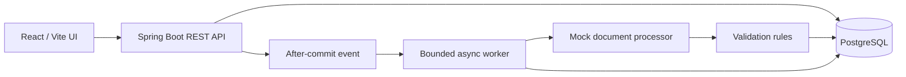

# SuretySeven Document Processing Pipeline

A full-stack document-processing application. Users upload PDF documents, the backend processes them asynchronously, validates mocked extracted data, records each lifecycle transition, and exposes the result through a React dashboard.

## Features

- PDF upload with document type and optional metadata
- SHA-256 content-hash duplicate detection, independent of filename
- Asynchronous processing with `UPLOADED`, `PROCESSING`, `PROCESSED`, and `FAILED` states
- Bounded retry handling for transient processor failures
- Extracted-data validation and readable validation errors
- Persistent processing-history audit trail
- Filtering, pagination, document detail, and processing timeline in the UI
- PostgreSQL for runtime persistence; H2 only for automated tests
- Structured application logs without document contents or extracted sensitive data

## Technology stack

| Layer | Technology |
| --- | --- |
| Backend | Java 17, Spring Boot, Spring Data JPA |
| Database | PostgreSQL |
| Frontend | React, Vite |
| Tests | JUnit 5, Mockito, H2 |

## Prerequisites

- Java 17 or newer
- Node.js 20 or newer with npm
- PostgreSQL 16 or 17

Verify local tools:

```bash
java -version
node --version
npm --version
psql --version
```

## Run locally

### 1. Install and start PostgreSQL

#### macOS

Install PostgreSQL with Homebrew:

```bash
brew install postgresql@17
brew services start postgresql@17
```

Create the application role and database:

```bash
createuser -P suretyseven
createdb -O suretyseven suretyseven
```

When prompted by `createuser`, use `suretyseven` as the password, or set `DATABASE_PASSWORD` to the password you choose when starting the backend.

To stop PostgreSQL later:

```bash
brew services stop postgresql@17
```

#### Windows (PowerShell)

Install PostgreSQL using Windows Package Manager:

```powershell
winget install --id PostgreSQL.PostgreSQL -e
```

The installer asks you to choose the password for the `postgres` administrator user. After installation, open **SQL Shell (psql)** from the Start menu, connect as `postgres`, and run:

```sql
CREATE USER suretyseven WITH PASSWORD 'suretyseven';
CREATE DATABASE suretyseven OWNER suretyseven;
```

The installer normally starts PostgreSQL automatically. If the service is stopped, open PowerShell as Administrator:

```powershell
Get-Service *postgres*
Start-Service postgresql-x64-17
```

Use the actual service name returned by `Get-Service` if it differs.

### 2. Start the backend

From the repository root, use a new terminal.

macOS/Linux:

```bash
cd backend
./mvnw spring-boot:run
```

Windows PowerShell:

```powershell
cd backend
.\mvnw.cmd spring-boot:run
```

The backend runs on `http://localhost:8080` by default. Verify it returns JSON:

```text
http://localhost:8080/documents/getAllDocuments
```

### 3. Start the frontend

Open another terminal from the repository root:

```bash
cd frontend
npm install
npm run dev
```

Open the Vite URL, normally [http://localhost:5173](http://localhost:5173).

## Configuration

The backend reads configuration from environment variables. Defaults support the local setup above.

| Variable | Default | Purpose |
| --- | --- | --- |
| `DATABASE_URL` | `jdbc:postgresql://localhost:5432/suretyseven` | PostgreSQL JDBC URL |
| `DATABASE_USERNAME` | `suretyseven` | PostgreSQL application user |
| `DATABASE_PASSWORD` | `suretyseven` | PostgreSQL application password |
| `SERVER_PORT` | `8080` | Backend HTTP port |
| `CORS_ALLOWED_ORIGINS` | `http://localhost:5173` | Allowed browser origin |

Example with a custom database password:

macOS/Linux:

```bash
DATABASE_PASSWORD='your-password' ./mvnw spring-boot:run
```

Windows PowerShell:

```powershell
$env:DATABASE_PASSWORD = "your-password"
.\mvnw.cmd spring-boot:run
```

The frontend calls the relative `/api` path. In development, Vite proxies it to `http://localhost:8080`. To change the backend host or port, copy `frontend/.env.example` to `frontend/.env`, set `VITE_BACKEND_URL`, then restart Vite.

## API reference

### Upload a document

```text
POST /documents
Content-Type: multipart/form-data
```

| Field | Required | Description |
| --- | --- | --- |
| `file` | Yes | A non-empty PDF file |
| `documentType` | Yes | `FINANCIAL_STATEMENT`, `INSURANCE_POLICY`, or `OTHER` |
| `metadata` | No | Optional metadata string |

A new document returns `201 Created`. Duplicate content returns `200 OK` with `duplicateUpload: true` and the existing document details.

### List documents

```text
GET /documents/getAllDocuments?page=0&size=10&status=PROCESSED&documentType=FINANCIAL_STATEMENT
```

`status` and `documentType` are optional. Results are sorted by newest upload first. `page` is zero-based; `size` is limited to 1-100.

### Document detail and history

```text
GET /documents/{documentId}
GET /documents/{documentId}/history
```

## Processing design

1. Upload validates and stores the document with `UPLOADED` status.
2. The system stores an `UPLOADED` audit entry in `processing_history`.
3. An after-commit event starts the worker only after the upload transaction succeeds.
4. The worker records `PROCESSING`, runs the mock processor, validates extracted data, then records `PROCESSED` or `FAILED`.
5. Every retry adds history rows; `documents.status` always stores the current state.

`PROCESSOR_TIMEOUT` and `PROCESSOR_ERROR` retry up to three attempts. Validation failures and `CORRUPTED_DOCUMENT` are terminal.

The processor is mocked for this assignment. Unit tests mock processor responses; the sample processor also recognizes `TIMEOUT`, `ERROR`, `INVALID_RESULT`, and `CORRUPTED_DOCUMENT` text markers in file content to make local failure-path testing deterministic.

## Data model

There are no JPA entity relationship mappings. Tables use simple identifier columns.

| Table | Purpose |
| --- | --- |
| `documents` | Current document state, metadata, content hash, and failure details |
| `extraction_result` | Extracted fields with a unique `document_id` |
| `processing_history` | One row per status transition, with `document_id` |

The unique `documents.content_hash` constraint makes duplicate detection safe even for simultaneous uploads.

## Architecture



## Test and build

Backend tests use H2 in-memory storage and do not require PostgreSQL.

macOS/Linux:

```bash
cd backend
./mvnw test
```

Windows PowerShell:

```powershell
cd backend
.\mvnw.cmd test
```

Build the frontend:

```bash
cd frontend
npm run build
```

## Production considerations

For higher volume, replace the in-process event with a transactional outbox and durable queue, store PDFs in object storage, add authentication and authorization, virus scanning, idempotency keys, metrics, tracing, horizontal workers, and scheduled retry handling.
